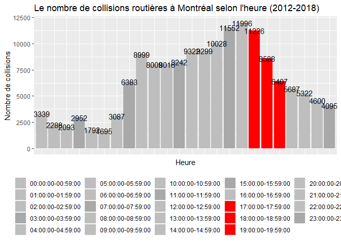

```r
library(tidyverse)
```
# Introduction

[Une analyse](https://www.japantimes.co.jp/news/2017/09/14/national/rate-fatal-accidents-twilight-prompts-police-urge-drivers-turn-headlights-earlier/#.XZKZykZKjD4) de l'Agence de nationale de police au Japan rapporte que 13,1 % des collisions routières fatales ont au lieu à l'aube, soit entre 17 h et 20 h. Ce projet visera donc à voir si le cas est similaire à Montréal avec une hypothèse similaire : il y a plus de collisions routières à l'aube.

# Le jeu de données

Le jeu de données s'intitule ["Collisions routières"](http://donnees.ville.montreal.qc.ca/dataset/collisions-routieres) et est disponible sur le site web de la ville de Montréal. Celui-ci détaille les collisions routières survenues à Montréal, excluant le réseau autoroutier, entre 2012 et 2018, et ayant fait l'objet d'un rapport de police (SPVM). Il s'agirait d'un sous-ensemble d'un autre jeu de données provenant de la SAAQ.

# Traitement des données

## Tidy Data avec tidyr
Le principe du Tidy Data comporte trois règles
<br> 1. Chaque variable doit avoir sa propre colonne.
<br> 2. Chaque Observation doit avoir sa propre rangée.
<br> 3. Chaque valeur doit avoir sa propre cellule.

Ces dernières sont respectées dans "Collisions routières" comme il est possible de voir ci-dessous, alors aucune modification majeure avec tidyr ne sera nécessaire avant la visualisation.


```r
collisions_read <- read_csv("accidents_2012_2018.csv")
```

```
## Parsed with column specification:
## cols(
##   .default = col_double(),
##   NO_SEQ_COLL = col_character(),
##   JR_SEMN_ACCDN = col_character(),
##   DT_ACCDN = col_date(format = ""),
##   SFX_NO_CIVQ_ACCDN = col_character(),
##   RUE_ACCDN = col_character(),
##   ACCDN_PRES_DE = col_character(),
##   CD_PNT_CDRNL_ROUTE = col_character(),
##   CD_PNT_CDRNL_REPRR = col_character(),
##   HR_ACCDN = col_character(),
##   GRAVITE = col_character(),
##   REG_ADM = col_character(),
##   MRC = col_character(),
##   LOC_COTE_Q = col_character(),
##   LOC_DETACHEE = col_character(),
##   LOC_IMPRECISION = col_character()
## )
```

```
## See spec(...) for full column specifications.
```

```r
collisions_select <- select(collisions_read, NO_SEQ_COLL, DT_ACCDN, HR_ACCDN, everything()) #permet de mettre en valeur les variables permettant de répondre à la question
collisions_select
```

```
## # A tibble: 171,271 x 68
##    NO_SEQ_COLL DT_ACCDN   HR_ACCDN JR_SEMN_ACCDN CD_MUNCP NO_CIVIQ_ACCDN
##    <chr>       <date>     <chr>    <chr>            <dbl>          <dbl>
##  1 SPVM _ 201~ 2012-02-01 Non pré~ ME               66102           3501
##  2 SPVM _ 201~ 2012-06-02 15:00:0~ SA               66023             NA
##  3 SPVM _ 201~ 2012-06-28 08:00:0~ JE               66023             NA
##  4 SPVM _ 201~ 2012-07-11 09:00:0~ ME               66023             NA
##  5 SPVM _ 201~ 2012-01-02 Non pré~ LU               66023           4849
##  6 SPVM _ 201~ 2012-01-02 14:00:0~ LU               66023             NA
##  7 SPVM _ 201~ 2012-01-03 12:00:0~ MA               66023          14665
##  8 SPVM _ 201~ 2012-01-02 14:00:0~ LU               66023          16760
##  9 SPVM _ 201~ 2012-01-03 09:00:0~ MA               66023           4931
## 10 SPVM _ 201~ 2012-01-03 Non pré~ MA               66023             NA
## # ... with 171,261 more rows, and 62 more variables:
## #   SFX_NO_CIVQ_ACCDN <chr>, BORNE_KM_ACCDN <dbl>, RUE_ACCDN <chr>,
## #   TP_REPRR_ACCDN <dbl>, ACCDN_PRES_DE <chr>, NB_METRE_DIST_ACCD <dbl>,
## #   CD_GENRE_ACCDN <dbl>, CD_SIT_PRTCE_ACCDN <dbl>, CD_ETAT_SURFC <dbl>,
## #   CD_ECLRM <dbl>, CD_ENVRN_ACCDN <dbl>, NO_ROUTE <dbl>,
## #   CD_CATEG_ROUTE <dbl>, CD_ETAT_CHASS <dbl>, CD_ASPCT_ROUTE <dbl>,
## #   CD_LOCLN_ACCDN <dbl>, CD_POSI_ACCDN <dbl>, CD_CONFG_ROUTE <dbl>,
## #   CD_ZON_TRAVX_ROUTR <dbl>, CD_PNT_CDRNL_ROUTE <chr>,
## #   CD_PNT_CDRNL_REPRR <chr>, CD_COND_METEO <dbl>,
## #   NB_VEH_IMPLIQUES_ACCDN <dbl>, NB_MORTS <dbl>, NB_BLESSES_GRAVES <dbl>,
## #   NB_BLESS_LEGERS <dbl>, AN <dbl>, NB_VICTIMES_TOTAL <dbl>,
## #   GRAVITE <chr>, REG_ADM <chr>, MRC <chr>,
## #   nb_automobile_camion_leger <dbl>, nb_camionLourd_tractRoutier <dbl>,
## #   nb_outil_equipement <dbl>, nb_tous_autobus_minibus <dbl>,
## #   nb_bicyclette <dbl>, nb_cyclomoteur <dbl>, nb_motocyclette <dbl>,
## #   nb_taxi <dbl>, nb_urgence <dbl>, nb_motoneige <dbl>, nb_VHR <dbl>,
## #   nb_autres_types <dbl>, nb_veh_non_precise <dbl>,
## #   NB_DECES_PIETON <dbl>, NB_BLESSES_PIETON <dbl>,
## #   NB_VICTIMES_PIETON <dbl>, NB_DECES_MOTO <dbl>, NB_BLESSES_MOTO <dbl>,
## #   NB_VICTIMES_MOTO <dbl>, NB_DECES_VELO <dbl>, NB_BLESSES_VELO <dbl>,
## #   NB_VICTIMES_VELO <dbl>, VITESSE_AUTOR <dbl>, LOC_X <dbl>, LOC_Y <dbl>,
## #   LOC_COTE_Q <chr>, LOC_COTE_P <dbl>, LOC_DETACHEE <chr>,
## #   LOC_IMPRECISION <chr>, LOC_LONG <dbl>, LOC_LAT <dbl>
```

## La visualisation avec ggplot

### La gestion des valeurs manquantes
Avant de visualiser les données, on remarque que pour 16 254 des accidents, l'heure n'est pas indiquée. Il faudra donc transformer les "Non précisé" en Na et par la suite les exclure de la visualisation. Pour faire cela, les fonctions mutate(), filter() et in.na() ont été utilisées.

### Le choix du geom
Geom_bar a été utilisé pour visualiser les données parce que l'heure de l'accident était entrée dans le jeu de données comme une valeur discrète, alors aucune précision ne serait gagnée avec la conversion en valeur continue pour tracer un histogramme. Les observation entre 17h et 20h a été mises en rouge pour mieux les distinguer.


```r
collisions <- read_csv("accidents_2012_2018.csv")
```

```
## Parsed with column specification:
## cols(
##   .default = col_double(),
##   NO_SEQ_COLL = col_character(),
##   JR_SEMN_ACCDN = col_character(),
##   DT_ACCDN = col_date(format = ""),
##   SFX_NO_CIVQ_ACCDN = col_character(),
##   RUE_ACCDN = col_character(),
##   ACCDN_PRES_DE = col_character(),
##   CD_PNT_CDRNL_ROUTE = col_character(),
##   CD_PNT_CDRNL_REPRR = col_character(),
##   HR_ACCDN = col_character(),
##   GRAVITE = col_character(),
##   REG_ADM = col_character(),
##   MRC = col_character(),
##   LOC_COTE_Q = col_character(),
##   LOC_DETACHEE = col_character(),
##   LOC_IMPRECISION = col_character()
## )
```

```
## See spec(...) for full column specifications.
```

```r
count(collisions, HR_ACCDN == "Non précisé")
```

```
## # A tibble: 2 x 2
##   `HR_ACCDN == "Non précisé"`      n
##   <lgl>                        <int>
## 1 FALSE                       155017
## 2 TRUE                         16254
```

```r
collisions_1 <- collisions %>%
  mutate(HR_ACCDN = ifelse(HR_ACCDN == "Non précisé", NA, HR_ACCDN)) %>% #remplace 'non précisé' dans le jeu de données avec NA
  filter(!is.na(HR_ACCDN)) #permet de filtrer NA et faire le graphique seulement avec des valeurs qui existent

ggplot(data = collisions_1,(mapping = aes(x = HR_ACCDN, fill = HR_ACCDN))) + 
  geom_bar() +
  labs(title = "Le nombre de collisions routières à Montréal selon l'heure (2012-2018)", fill = "Heure de la collsion", x = "Heure", y = "Nombre de collisions") +
  theme(axis.text.x=element_blank(),axis.ticks.x=element_blank(), legend.position = "bottom", legend.title = element_blank()) + #nettoyage de l'axe des x
  geom_text(aes(label = stat(count)), stat = 'count') + #permet de connaître plus facilement le nombre de collisions
  scale_fill_manual(values = c("grey","grey","grey","darkgrey","grey","grey","grey","darkgrey","grey","grey","grey","darkgrey","grey","grey","grey","darkgrey","grey","red","red","red","grey","grey", "grey","darkgrey"))  #permet de mettre valeur les observations de 17h à 20h
```

<!-- -->
# Conclusion

Ainsi, il est possible de voir que le pic dans le nombre d'accidents a lieu entre 15h et 18h, alors il y a un léger décalage avec ce que notre hypothèse de départ proposait.


# Bibliographie

R for Data Science
https://stackoverflow.com/questions/36048033/manually-colouring-plots-with-scale-fill-manual-in-ggplot2-not-working
https://www.rdocumentation.org/packages/plyr/versions/1.8.4/topics/count


